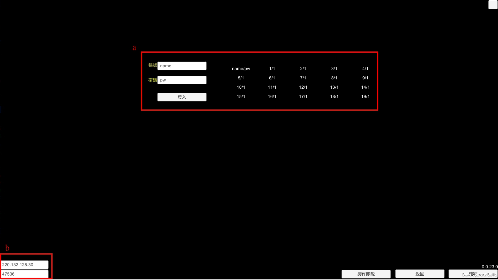
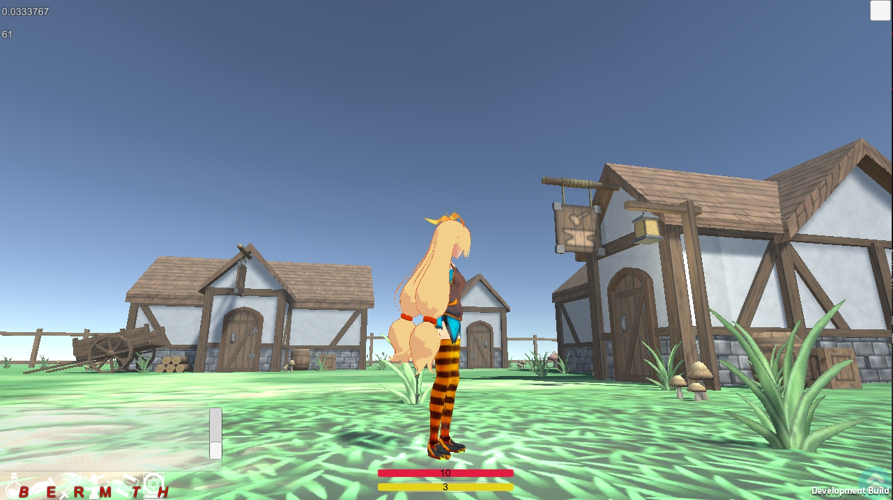

# GameProject1


這是一款用Unity撰寫的**未完成**開發項目，主要是為了展示使用 [Regulus.Remote](https://github.com/jiowchern/Regulus.Remote) 開發的專案.  


## 啟動

### 前端
[Client 下載](https://drive.google.com/file/d/1VtITGMzOdihBToJR1snmppHuN8rlSAXH/view?usp=sharing)


### 後端
下載專案後到```GameProject1-Backend.git``` 運行下面指令  
```powershell
\GameProject1-Backend.git> .\run.ps1
```


## 遊戲導覽

###  1. 選擇單機或連線
  
開啟進來第一個畫面會看到選擇遊戲的模式，Online他需要一個連線用的伺服器，這通常是連到作者提供的機器上，而選擇Offline則不需要伺服器可以直接進入遊戲，當然也無法看到其他使用者。
###  2. 登入畫面
 
a. 登入帳號直接寫在右邊 20 組帳號，選一組登入，如果前面已經有人正在使用該使用者則會被踢出。  
b. 伺服器 IP 設定介面，如果是選擇 Offline 則不用理會，如果有自己架設伺服器請填入自己的 IP ，預設是作者自己提供的伺服器地址。

### 3. 村莊
 
登入第一個村莊，在這裡玩家可以嘗試按R啟動戰鬥模式或是按B開啟背包切換裝備等等。  
  
附近有迷宮入口上面寫著"**Maze is here**"。  

### 4. 主介面
  
<!-- [道具](doc/hud-item.md)  
[探索](doc/hud-exp.md)  
[戰鬥](doc/hud-fight.md)  
[製作](doc/hud-create.md)  
[對話](doc/hud-chat.md)  
[地圖](doc/hud-map.md)  
[控制台](doc/hud-contorl.md)  -->

### 5. 迷宮
 
這是一個隨機產生的迷宮, 有著N個入口與N個出口, 探索到底會回到起點.  


