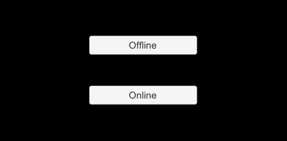
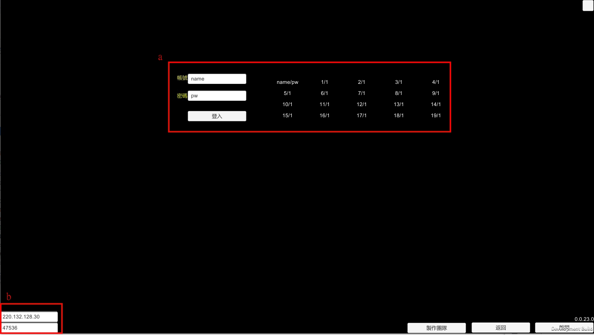
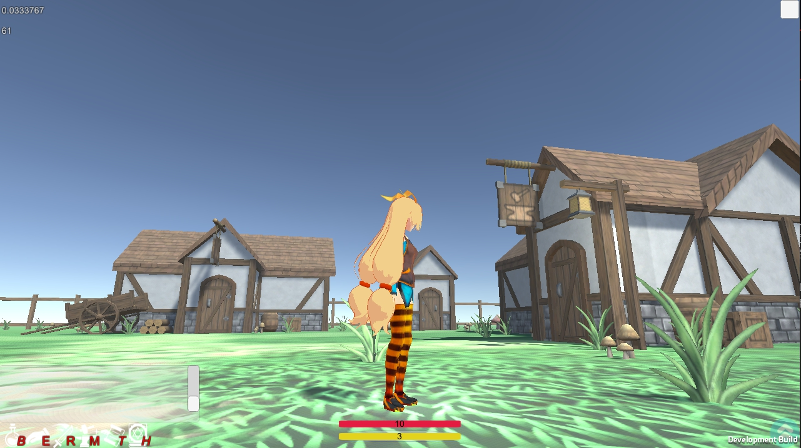
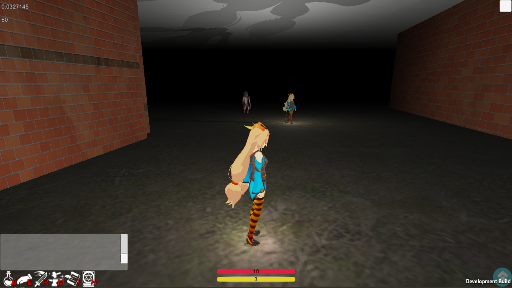

# GameProject1

這是一款用Unity撰寫的**未完成**開發項目，雖然作者還是有想要繼續開發的想法，但是只會在假日時候做些簡單的開發。 

[Client 點我下載](https://drive.google.com/file/d/1ItZIiPb-FhKoaTthAB4qttuAhBIbreFT/view?usp=sharing)

# 遊戲導覽

##  1. 選擇單機或連線
  
開啟進來第一個畫面會看到選擇遊戲的模式，Online他需要一個連線用的伺服器，這通常是連到作者提供的機器上，而選擇Offline則不需要伺服器可以直接進入遊戲，當然也無法看到其他使用者。
##  2. 登入畫面
 
a. 登入帳號直接寫在右邊 20 組帳號，選一組登入，如果前面已經有人正在使用該使用者則會被踢出，一般來說不太可能同時會超過 20 位用戶如果真的都登不進去請用 mail 聯絡作者。  
b. 伺服器 IP 設定介面，如果是選擇 Offline 則不用理會，如果有自己架設伺服器請填入自己的 IP ，預設是作者自己提供的伺服器如果有連不上情況請用 mail 聯絡作者。

## 3. 村莊
 
登入第一個村莊，在這裡玩家可以嘗試按R啟動戰鬥模式或是按B開啟背包切換裝備等等。
附近有迷宮入口上面寫著"**Maze is here**"。  
__P.S 裝備介面現在有Bug，一旦切換完並不會馬上看到改變需要關閉背包視窗才會更新。__
## 4. 探險
 
目前地圖做有兩個迷宮與兩個村莊，跟一些**原住民**。

